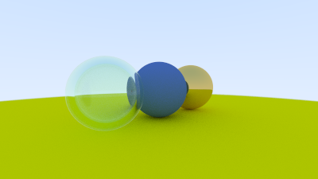

# RTinAWeekend

 Implemented a physically accurate Path/Ray tracing renderer as detailed by Peter Shirley in Ray Tracing in a Weekend.
 
Programmed all functions only using the basic C++ libraries. 

Developed the following classes for a 3D camera, rays, materials, and vectors.

Applied several laws of physics to portray the way light bounces in our world such as reflection and refraction. As for materials, I implemented diffuse, metallic, and glass. They each include a property for color while metal includes reflection fuzziness and glass includes an index of refraction.

Here's and example of a rendered scene:

 
